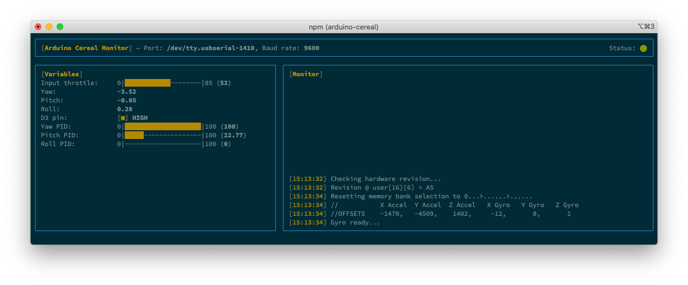

# Arduino Cereal Monitor

Drop-in replacement for Arduino's serial monitor with variable watches.



### How it works

Use `Serial.print`, `Serial.println`, etc. to print data to **[Monitor]** window. To track variables in *[Variables]* window, use  *Cereal library* ([read more](./arduino/README.md)). 

### Install

```bash
$ npm install --global arduino-cereal
```

OR run it with [npx](https://www.npmjs.com/package/npx)

```bash
$ npx arduino-cereal
```

*Requires Node v14.0.0 or later*

### CLI options

```bash
$ arduino-cereal --help

  Usage
    $ arduino-cereal

  Options
    --port   Serial port
    --baud   Baud rate (default: 9600)
    --theme  Theme name (light, dark, black, white)
    --fps    Screen render rate (default: 15)
```

* **port:** – Serial port to which Arduino board is connected.
* **baud:** – Baud rate. Default value 9600
* **theme:** – Change the color theme. Available options are: *light*, *dark*, *black*, *black*. Default theme is *dark*. Read more about [theme customization](THEME.md). 
* **fps** – Control the rate at which CLI screen is updated. Helps dealing with flickering on some terminal apps (iTerm). Default: 15

Example:
```bash
$ arduino-cereal --port=/dev/tty.usbserial-1410 --baud=19200 --theme=light --fps=10
```

### Configuration file

Alternatively CLI options can be read from a file – `cereal.config.json`. This file is expected to be located in current working directory.

```json5
{
  "port": "/dev/tty.usbserial-1410",
  "baud": 9600,
  "fps": 15,
  
  "theme": { /** Theme customization options */ }
}
```

### Contributing

Contributions are welcome. 🎉

### License

Licensed under the MIT license. See the [LICENSE.md](LICENSE.md) for more information.
