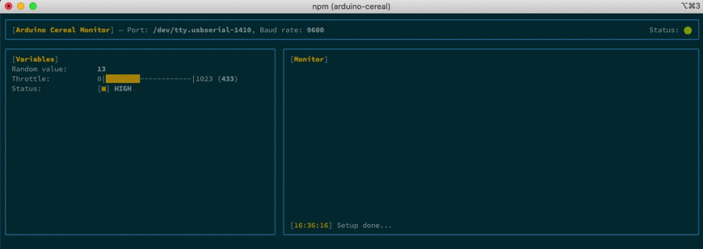

# Arduino Cereal Library

Arduino library for tracking variables in [Cereal monitor](../README.md).

### Install

Download and manually install to your Arduino libraries. Read the "Manual Installation" section on Arduino's [library installation instruction](https://www.arduino.cc/en/Guide/Libraries) page.

### Usage

Cereal monitor supports three different types of variables: *basic* variable, *range*, and a *flag* variable.

For basic variable output, use:
```cpp
Cereal.variable(name, value);
```

For range variable outputs use: 
```cpp
Cereal.range(name, value, from, to);
Cereal.analog(name, value);
```

For flag variable output use:
```cpp
Cereal.digital(name, value);
``` 

### Example

```cpp
#include "Cereal.h"

#define STATUS_PIN 3
#define THROTTLE_PIN A2

void setup() {
  // Set the baud rate for serial data transmission 
  Serial.begin(9600);
  
  pinMode(STATUS_PIN, INPUT);
  pinMode(THROTTLE_PIN, INPUT);
   
  // Serial output shown in [Monitor] window
  Serial.println("Setup done...");
}

void loop() {
  int rnd = random(10, 20);
  int throttle = analogRead(THROTTLE_PIN);
  int status = digitalRead(STATUS_PIN);
  
  // Basic variable type output
  Cereal.variable("Random", rnd);
  
  // Range variable type output
  Cereal.analog("Throttle", throttle);
  
  // Flag variable type output
  Cereal.digital("Status", status);
}

```

Running this examples gives the following output:



### Software Serial

You can send data to multiple Cereal monitors by creating more than one `CerealStream`.
`CerealStream` object take a destination stream it should write to.

Destination stream is any object of class that inherits from built-in `Print` class.

```cpp
#include "SoftwareSerial.h"
#include "Cereal.h"

int i = 0;

SoftwareSerial sSerial(3, 4);
CerealStream sCereal(sSerial);

void setup() {
  Serial.begin(9600);
  sSerial.begin(9600);
}

void loop() {
  // Writes to HardwareSerial0
  Cereal.variable("I", i++);

  // Writes to SoftwareSerial RX(3)/TX(4)
  sCereal.variable("I", i++);
}

```
